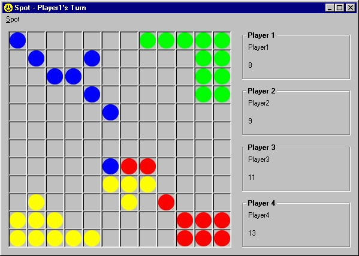



## Spot\! \- A Puzzle Game with AI

### Description

This is a little game I (re)made in my spare time as my first official attempt at game programming. The object is to either wipe out the other player, or, by the time the board fills up, to have the most spots on the board. Here are the rules:

To move, click a spot of your color, and it will start blinking. Then click a square where you want to move to. You can move either 1 or 2 spaces in any direction: horizontally, vertically, diagonally, or a combination (e.g., 1 space horizontally, 1 space diagonally). You cannot move into a spot already occupied by another player.

If you move 1 space, you will "clone" your spot. Your 1 spot will become 2.

If you move 2 spaces, you will "jump" your spot. Your 1 spot stays 1 spot, and just moves to the new square.

If you move your spot within one space of another player's spot(s), you capture their spot(s), and their spot(s) will change to your color.

If there are no legal moves for you to make, you will be prompted with a message box informing you that you have no possible moves and the game will proceed to the next player.

The game is over either when all but one player's spots have been eliminated, or when the board is entirely filled. A message will appear declaring the winner of the game.
 
### More Info
 

             |
---                |---
**Submitted On**   |2002-04-14 12:51:56
**By**             |[M\. Adkins](https://github.com/Planet-Source-Code/PSCIndex/blob/master/ByAuthor/m-adkins.md)
**Level**          |Beginner
**User Rating**    |5.0 (15 globes from 3 users)
**Compatibility**  |VB 5\.0, VB 6\.0
**Category**       |[Games](https://github.com/Planet-Source-Code/PSCIndex/blob/master/ByCategory/games__1-38.md)
**World**          |[Visual Basic](https://github.com/Planet-Source-Code/PSCIndex/blob/master/ByWorld/visual-basic.md)
**Archive File**   |[Spot\!\_\-\_A\_91790682002\.zip](https://github.com/Planet-Source-Code/m-adkins-spot-a-puzzle-game-with-ai__1-35611/archive/master.zip)

